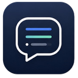
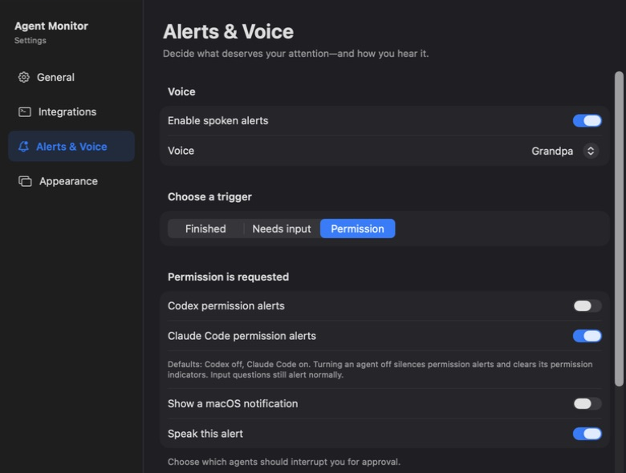

<div align="center">



# Agent Monitor

**Keep your coding agents in sight. Get back to them when it matters.**

A native macOS menu-bar app for [Codex](https://developers.openai.com/codex/cli/) and [Claude Code](https://code.claude.com/docs/en/overview).<br>
See who's working, who needs an answer, and who's finished—across your projects and terminals.

[](https://github.com/seschulz/agent-monitor/releases/latest)
[](#download--get-started)
[](CONTRIBUTING.md)
[](https://github.com/seschulz/agent-monitor/actions/workflows/release.yml)

### [Download for macOS →](https://github.com/seschulz/agent-monitor/releases/latest)

[Get started](#download--get-started) · [Explore the features](#a-small-app-for-a-busy-workflow) · [Build & contribute](CONTRIBUTING.md) · [Get help](docs/TROUBLESHOOTING.md)

</div>

<p align="center">
  
  <br>
  <sub>The real floating widget in compact mode, cropped to this repository's session.</sub>
</p>

## A small app for a busy workflow

Running agents in several projects shouldn't mean constantly checking terminal tabs.

| | What you get |
| --- | --- |
| 👀 **Your sessions at a glance** | Project, agent, terminal, status, and elapsed time in your menu bar and an optional floating widget. |
| 💬 **Know when you're needed** | Input requests stand out in amber. Permission alerts are configurable separately for Codex and Claude Code. |
| 🔊 **Alerts in your own words** | Choose notifications, spoken messages, or both for each trigger. Customize the voice and message, then preview it. |
| ↗️ **Jump back into context** | Click a session to open its terminal app. Optional exact terminal-tab selection for IntelliJ IDEA and Rider. |
| 🎨 **Make it fit your desktop** | Move the widget and choose its size, background, opacity, color, contrast, and completed-session retention. |
| 🔒 **Session metadata stays local** | Lifecycle events travel over a private socket on your Mac. Prompts, responses, command contents, and environment variables aren't recorded. |

## Download & get started

**You'll need macOS 15 or later and Codex CLI, Claude Code, or both.** The release is universal: one download for Apple silicon and Intel Macs. Xcode is only needed for development.

1. **[Download the latest release](https://github.com/seschulz/agent-monitor/releases/latest).** Choose the `Agent-Monitor-<version>.dmg` asset.
2. **Install the app.** Open the DMG and drag **Agent Monitor** to **Applications**, then launch it.
3. **Connect your agents.** Choose **Install Integrations** on first launch. Existing Codex and Claude Code hooks are preserved.
4. **Start a session.** In Codex, open `/hooks` to review and trust the added hooks when prompted. Start a new Codex or Claude Code session and look for it in the menu bar or widget.

> [!NOTE]
> Releases are ad-hoc signed and aren't Apple-notarized yet. If macOS blocks the first launch, follow the [first-launch instructions](docs/TROUBLESHOOTING.md#macos-blocks-the-first-launch). Monitoring itself does **not** require Accessibility or Screen Recording access.

Already installed? Check **Settings → General → Software Updates**, or let the built-in updater check automatically. Updates are verified using Sparkle's Ed25519 signatures before installation.

## Three states. One place to look.

| State | What it means | What you can do |
| --- | --- | --- |
| 🔵 **Working** | An agent is running a turn. | Keep focusing; the widget tracks its elapsed time. |
| 🟠 **Needs attention** | An agent is waiting for input or an enabled permission request. | Click the session and answer in its terminal. |
| 🟢 **Finished** | The agent completed its turn. | Return to the result, or dismiss the entry when you're done. |

Waiting sessions stay visible until work resumes, the session ends, or you dismiss them. Completed sessions remain for the period you choose. Overlapping finish events don't override a pending input request.

### Choose what interrupts you

In **Settings → Alerts & Voice**, select a trigger:

| Trigger | Configure it your way |
| --- | --- |
| **Finished** | A notification, a spoken completion message, or both. |
| **Needs input** | An alert when the agent explicitly asks you a question. |
| **Permission** | Separate agent switches, plus notification and speech options. **Codex defaults off; Claude Code defaults on.** |

Automatically reviewing Codex permissions with another agent? Leave its permission alerts off. Your real input questions still stand out.

Every trigger has its own editable spoken message, live text preview, voice playback, and reset button. For example:

```text
{agent} finished working on {project}
{agent} needs your input in {project}
{agent} needs permission in {terminal}
```

Available placeholders: `{agent}`, `{project}`, `{terminal}`, and `{directory}`. Leave a message blank to use that trigger's default.



*Captured from the running app; cropped to the permission controls. Appearance and alert preferences are configurable.*

### Return to the right place

Click any session to bring its host application forward. Agent Monitor recognizes Terminal, iTerm2, Ghostty, IntelliJ IDEA, Rider, VS Code, and compatible desktop forks when their application metadata is available.

**IntelliJ IDEA and Rider** can also select the connected terminal tab, without an IDE plugin. Enable **Settings → Integrations → Terminal Navigation** and grant Accessibility access if you want this feature. Otherwise, clicks simply open the IDE—no repeated permission or linking dialogs.

With tab switching off, the monitor still brings the matching IDE project window forward when it can identify the project from the live terminal session. This does not require Accessibility access.

**VS Code and its forks** open the editor; exact terminal-tab selection is not supported. See [terminal navigation details and limitations](docs/TROUBLESHOOTING.md#terminal-navigation).

## Find your settings

| Section | What's inside |
| --- | --- |
| **General** | Launch at login, software updates, and local session history. |
| **Integrations** | Install or remove agent hooks; configure terminal navigation. |
| **Alerts & Voice** | Per-trigger notifications, speech, custom messages, and each agent's permission alerts. |
| **Appearance** | Menu-bar rows, floating-widget visibility, density, styling, and retention. |

Tip: if your menu bar is crowded, open Agent Monitor again from Spotlight or Finder to bring Settings forward.

## Build something with us

Agent Monitor is written in **Swift and SwiftUI**, with a small command-line helper and a local Unix socket connecting agent events to the app.

```sh
git clone https://github.com/seschulz/agent-monitor.git
cd agent-monitor
swift build
swift test
python3 -m unittest Tests/configure_test.py
```

Want to run your changes in the menu bar? `./scripts/install-local.sh` builds and installs a local copy, configures the hooks, and launches the app. It replaces a running local installation; see the guide before using it for the first time.

**[Read the contributor guide →](CONTRIBUTING.md)** for Xcode setup, the project map, the development loop, and testing guidance. Maintainers can find packaging and publishing details in the [release guide](docs/RELEASING.md).

Bug reports, focused fixes, documentation improvements, and reproducible compatibility reports are welcome. [Open an issue](https://github.com/seschulz/agent-monitor/issues) or [start a pull request](https://github.com/seschulz/agent-monitor/pulls).

## Help & local data

- **Nothing showing up?** Start with [the connection check](docs/TROUBLESHOOTING.md#no-sessions-appear).
- **Terminal navigation not behaving?** Check [host support and permissions](docs/TROUBLESHOOTING.md#terminal-navigation).
- **Want to remove the app?** Follow [the uninstall steps](docs/TROUBLESHOOTING.md#uninstall).

Session history and the event socket live in `~/Library/Application Support/AgentMonitor`. The monitor stores session identifiers, project paths, agent and terminal metadata, timestamps, and status. Use **Settings → General → Session Data → Clear Session History** to clear saved sessions. The built-in updater contacts GitHub to check for releases and download updates.
